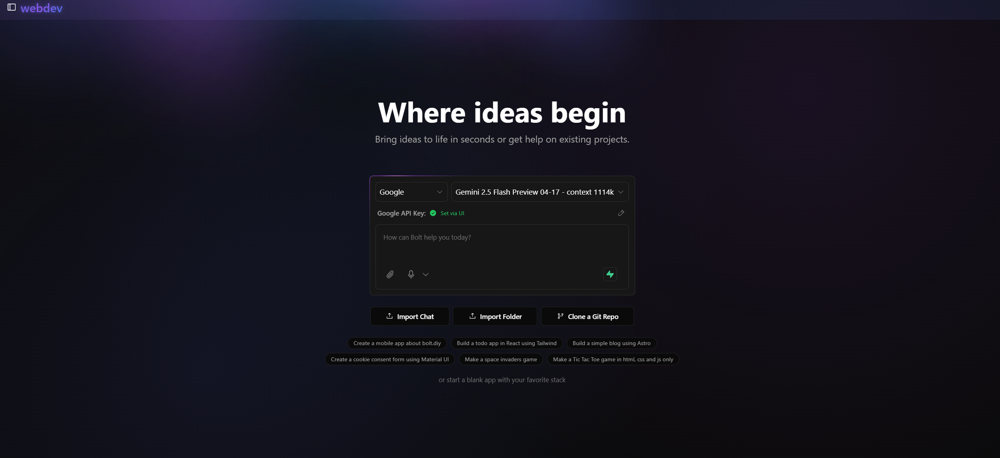

# webdev v3.22

<div align="center">

[](https://webdev.ai)

**🚀 AI-Powered Web Development Assistant**

*Build, debug, and deploy web applications faster than ever with the power of AI*

[](https://github.com/Xenonesis/webDev.ai-.git)
[](https://opensource.org/licenses/MIT)
[](https://nodejs.org/)
[](https://www.typescriptlang.org/)

</div>

---

## 🌟 Overview

Welcome to **webdev**, a revolutionary AI-powered web development assistant that transforms how you build web applications! This cutting-edge platform leverages multiple Large Language Models (LLMs) to provide intelligent coding assistance, debugging support, and deployment capabilities - all within your browser.

### 🎯 Key Highlights

- **Multi-LLM Support**: Choose from OpenAI, Anthropic, Ollama, OpenRouter, Gemini, LMStudio, Mistral, xAI, HuggingFace, DeepSeek, Groq, and more
- **Browser-Based Development**: Full-stack web development directly in your browser using WebContainer technology
- **Intelligent Code Generation**: AI-powered code writing, debugging, and optimization
- **Real-time Collaboration**: Seamless integration with modern development workflows
- **Extensible Architecture**: Easy integration of additional AI models via Vercel AI SDK

### 👨‍💻 Author

**Aditya** - *Project Creator & Lead Developer*

---

## ⚖️ Comparison

### webdev vs Competitors

| Feature | **webdev.ai** | **Bolt.new** | **Lovable** |
|---------|---------------|---------------|-------------|
| **🤖 AI Models** | 15+ providers (OpenAI, Anthropic, Ollama, etc.) | Limited to specific models | Proprietary AI |
| **💰 Pricing** | Free & Open Source | Subscription-based | Subscription-based |
| **🌐 Environment** | Browser-based WebContainer | Browser-based | Cloud-based |
| **🔧 Customization** | Fully customizable, self-hosted | Limited customization | Platform-locked |
| **📱 Local Development** | Full local support with Docker | Limited local options | Cloud-only |
| **🔒 Privacy** | Complete data control | Data sent to servers | Data sent to servers |
| **🚀 Deployment** | Multiple options (Netlify, Docker, etc.) | Platform-specific | Platform-specific |
| **📦 Export** | Full project export as ZIP | Limited export options | Limited export options |
| **🔄 Version Control** | Git integration + local history | Basic version control | Basic version control |
| **🎨 UI Flexibility** | Highly customizable interface | Fixed interface | Fixed interface |
| **🛠️ Extensibility** | Open source, fully extensible | Closed source | Closed source |
| **📊 Analytics** | No tracking, privacy-first | User tracking | User tracking |

### 🎯 Why Choose webdev.ai?

#### **🆓 Cost-Effective**
- **100% Free**: No subscription fees, no hidden costs
- **Pay-per-use**: Only pay for AI API usage you control
- **Self-hosted**: Reduce long-term costs

#### **🔒 Privacy & Control**
- **Your Data**: Complete control over your code and data
- **Local Processing**: Option to run everything locally
- **No Vendor Lock-in**: Export and migrate anytime

#### **🚀 Performance & Flexibility**
- **Multiple AI Providers**: Choose the best model for each task
- **Local Development**: Full Docker support for offline work
- **Custom Integrations**: Extend with your own features

#### **🌟 Developer-Friendly**
- **Open Source**: Contribute and customize freely
- **Modern Stack**: Built with latest web technologies
- **Active Community**: Growing developer community

---

## 📋 Table of Contents

- [🌟 Overview](#-overview)
- [⚖️ Comparison](#️-comparison)
- [✨ Features](#-features)
- [🚀 Quick Start](#-quick-start)
- [⚙️ Installation](#️-installation)
- [🔧 Configuration](#-configuration)
- [🐳 Docker Setup](#-docker-setup)
- [🛠️ Development](#️-development)
- [📜 Available Scripts](#-available-scripts)
- [🤝 Contributing](#-contributing)
- [🗺️ Roadmap](#️-roadmap)
- [❓ FAQ](#-faq)
- [📄 License](#-license)

---

## ✨ Features

### 🎯 Core Capabilities

- **🤖 Multi-LLM Integration**: Support for 15+ AI providers including:
  - OpenAI (GPT-4, GPT-3.5)
  - Anthropic (Claude 3.5 Sonnet, Claude 3 Opus)
  - Google (Gemini Pro, Gemini Ultra)
  - Ollama (Local models)
  - Groq, Mistral, xAI, HuggingFace, DeepSeek, and more

- **🌐 Browser-Based Development**: Full-stack development environment powered by WebContainer technology
- **📁 Project Management**: Create, edit, and manage complete web applications
- **🔄 Real-time Preview**: Instant preview of your applications with hot reload
- **📱 Responsive Design**: Mobile-friendly interface for development on any device

### 🛠️ Advanced Features

- **🖼️ Image Integration**: Attach images to prompts for visual context
- **💻 Integrated Terminal**: Built-in terminal for running commands and viewing output
- **⏪ Version Control**: Revert code changes and track project history
- **📦 Export Options**: Download projects as ZIP files or sync to local folders
- **🚀 One-Click Deployment**: Deploy directly to Netlify and other platforms
- **🔍 Error Detection**: Automatic detection and AI-powered fixing of terminal and preview errors

---

## 🚀 Quick Start

Get webdev.ai running in under 5 minutes!

### Prerequisites

- **Node.js** 18.18.0 or higher
- **pnpm** (recommended) or npm

### Installation

```bash
# Clone the repository
git clone https://github.com/Xenonesis/webDev.ai-.git
cd webDev.ai-

# Install dependencies
pnpm install

# Start development server
pnpm run dev
```

Open [http://localhost:5173](http://localhost:5173) in your browser and start building! 🎉

---

## ⚙️ Installation

### 📥 Option 1: Download Release (Recommended for Users)

[](https://github.com/Xenonesis/webDev.ai-/releases/latest)

1. Click the badge above to go to the latest release
2. Download the **source.zip** file
3. Extract the ZIP file to your desired location
4. Follow the installation steps below

### 🔧 Option 2: Clone Repository (Recommended for Developers)

```bash
# Clone the repository
git clone https://github.com/Xenonesis/webDev.ai-.git
cd webDev.ai-

# Install dependencies
pnpm install

# Start development server
pnpm run dev
```

---

## 🔧 Configuration

### 🔑 Setting Up API Keys

webdev.ai supports multiple AI providers. You'll need API keys for the providers you want to use:

#### Supported Providers

| Provider | Models | Setup Guide |
|----------|--------|-------------|
| **OpenAI** | GPT-4, GPT-3.5 | [Get API Key](https://platform.openai.com/api-keys) |
| **Anthropic** | Claude 3.5 Sonnet, Claude 3 Opus | [Get API Key](https://console.anthropic.com/) |
| **Google** | Gemini Pro, Gemini Ultra | [Get API Key](https://makersuite.google.com/app/apikey) |
| **Groq** | Llama, Mixtral | [Get API Key](https://console.groq.com/keys) |
| **Ollama** | Local Models | [Install Ollama](https://ollama.ai/) |
| **HuggingFace** | Various Models | [Get API Key](https://huggingface.co/settings/tokens) |

#### Adding API Keys

1. **Via UI (Recommended)**:
   - Open webdev.ai in your browser
   - Select your provider from the dropdown
   - Click the pencil (edit) icon
   - Enter your API key securely

2. **Via Environment Variables**:
   ```bash
   # Create .env.local file
   OPENAI_API_KEY=your_openai_key_here
   ANTHROPIC_API_KEY=your_anthropic_key_here
   GOOGLE_GENERATIVE_AI_API_KEY=your_google_key_here
   GROQ_API_KEY=your_groq_key_here
   # Add other provider keys as needed
   ```

### ⚙️ Custom Base URLs

For local AI providers (Ollama, LM Studio) or custom endpoints:

1. Click the settings icon in the sidebar
2. Navigate to the "Providers" tab
3. Search for your provider
4. Enter your custom base URL

**Example URLs**:
- Ollama: `http://localhost:11434`
- LM Studio: `http://localhost:1234`

---

## 🐳 Docker Setup

Docker provides an isolated environment and simplified deployment. Choose this option if you prefer containerized development.

### Prerequisites

- **Docker**: [Download Docker](https://www.docker.com/)
- **Docker Compose**: Usually included with Docker Desktop

### 🚀 Quick Docker Start

```bash
# Clone the repository
git clone https://github.com/Xenonesis/webDev.ai-.git
cd webDev.ai-

# Build and run with Docker Compose
docker compose --profile development up
```

### 🔧 Manual Docker Build

```bash
# Build development image
npm run dockerbuild

# Or build directly with Docker
docker build . --target webdev-ai-development

# Run the container
docker run -p 5173:5173 webdev-ai:development
```

### 🌐 Production Docker

```bash
# Build production image
npm run dockerbuild:prod

# Run production container
docker compose --profile production up
```

**Access the application**: Open [http://localhost:5173](http://localhost:5173)

---

## 🛠️ Development

### 📋 System Requirements

- **Node.js**: 18.18.0 or higher
- **Package Manager**: pnpm (recommended), npm, or yarn
- **Memory**: 4GB RAM minimum, 8GB recommended
- **Storage**: 2GB free space

### 🔧 Development Setup

1. **Install Node.js**:
   - Visit [Node.js Download Page](https://nodejs.org/en/download/)
   - Download the LTS version for your OS
   - Verify installation: `node --version`

2. **Install pnpm** (recommended):
   ```bash
   npm install -g pnpm
   ```

3. **Clone and Setup**:
   ```bash
   git clone https://github.com/Xenonesis/webDev.ai-.git
   cd webDev.ai-
   pnpm install
   ```

4. **Start Development Server**:
   ```bash
   pnpm run dev
   ```

### 🔄 Development Workflow

- **Hot Reload**: Changes are automatically reflected in the browser
- **TypeScript**: Full TypeScript support with type checking
- **Linting**: ESLint and Prettier for code quality
- **Testing**: Vitest for unit and integration tests

### 🧪 Running Tests

```bash
# Run tests once
pnpm test

# Run tests in watch mode
pnpm test:watch

# Type checking
pnpm typecheck
```

---

## 📜 Available Scripts

webdev.ai comes with a comprehensive set of npm/pnpm scripts for development, building, and deployment:

### 🚀 Development Scripts

```bash
# Start development server with hot reload
pnpm run dev

# Run tests once
pnpm test

# Run tests in watch mode
pnpm test:watch

# Type checking
pnpm typecheck

# Lint code and fix issues
pnpm lint:fix
```

### 🏗️ Build Scripts

```bash
# Build for production
pnpm run build

# Build optimized version
pnpm run build:optimized

# Preview production build locally
pnpm run preview
```

### 🐳 Docker Scripts

```bash
# Build development Docker image
pnpm run dockerbuild

# Build production Docker image
pnpm run dockerbuild:prod

# Run Docker container
pnpm run dockerrun
```

### 🚀 Deployment Scripts

```bash
# Deploy to Cloudflare Pages
pnpm run deploy

# Start production server
pnpm run start
```

### 🖥️ Electron Scripts

```bash
# Build Electron app for current platform
pnpm run electron:build:unpack

# Build for specific platforms
pnpm run electron:build:mac
pnpm run electron:build:win
pnpm run electron:build:linux
```

---

## 🤝 Contributing

We welcome contributions from the community! webdev.ai is built by developers, for developers.

### 🌟 Ways to Contribute

- **🐛 Bug Reports**: Found a bug? [Open an issue](https://github.com/Xenonesis/webDev.ai-/issues)
- **💡 Feature Requests**: Have an idea? [Suggest a feature](https://github.com/Xenonesis/webDev.ai-/issues)
- **🔧 Code Contributions**: Submit pull requests for bug fixes or new features
- **📖 Documentation**: Help improve our documentation
- **🎨 UI/UX**: Contribute to design and user experience improvements

### 📋 Contribution Guidelines

1. **Fork the Repository**
2. **Create a Feature Branch**: `git checkout -b feature/amazing-feature`
3. **Make Your Changes**: Follow our coding standards
4. **Test Your Changes**: Ensure all tests pass
5. **Commit Your Changes**: `git commit -m 'Add amazing feature'`
6. **Push to Branch**: `git push origin feature/amazing-feature`
7. **Open a Pull Request**: Describe your changes clearly

### 🔧 Development Guidelines

- Follow TypeScript best practices
- Write tests for new features
- Update documentation as needed
- Follow the existing code style
- Keep commits atomic and well-described

For detailed contribution guidelines, see [CONTRIBUTING.md](CONTRIBUTING.md).

---

## 🗺️ Roadmap

### ✅ Recently Completed

- ✅ Multi-LLM provider support (15+ providers)
- ✅ Docker containerization
- ✅ Image attachment to prompts
- ✅ Integrated terminal with error detection
- ✅ One-click deployment to Netlify
- ✅ Project export and import functionality
- ✅ Mobile-responsive design
- ✅ Real-time collaboration features

### 🚧 In Progress

- 🔄 **File Locking System**: Prevent unnecessary file rewrites
- 🔄 **Enhanced Prompting**: Better support for smaller LLMs
- 🔄 **Backend Agents**: Multi-step AI agent workflows
- 🔄 **Plugin System**: Extensible architecture for custom features

### 🎯 Upcoming Features

- 🔮 **Voice Prompting**: Voice-to-code functionality
- 🔮 **VSCode Integration**: Native IDE integration
- 🔮 **Document Upload**: Reference materials and templates
- 🔮 **Azure OpenAI**: Additional enterprise AI provider
- 🔮 **Supabase Integration**: Database and backend services
- 🔮 **Project Planning**: AI-powered project architecture

### 🎨 UI/UX Improvements

- 🎨 **Dark/Light Theme**: Enhanced theming system
- 🎨 **Accessibility**: WCAG compliance improvements
- 🎨 **Mobile Experience**: Native mobile app development
- 🎨 **Performance**: Faster loading and rendering

View our detailed roadmap: [Project Roadmap](https://roadmap.sh/r/ottodev-roadmap-2ovzo)

---

## ❓ FAQ

### 🤔 Common Questions

**Q: Which AI model should I use for best results?**
A: For optimal performance, we recommend:
- **Anthropic Claude 3.5 Sonnet**: Best overall coding performance
- **OpenAI GPT-4**: Excellent for complex projects
- **Local Ollama**: Privacy-focused development

**Q: Can I use webdev.ai offline?**
A: Partially. You can run the interface locally, but AI providers require internet connectivity. Use Ollama for offline AI capabilities.

**Q: How do I deploy my projects?**
A: webdev.ai supports multiple deployment options:
- One-click Netlify deployment
- Export as ZIP for manual deployment
- Direct GitHub integration
- Docker containerization

**Q: Is webdev.ai free to use?**
A: Yes! webdev.ai is open-source and free. You only pay for the AI provider APIs you choose to use.

**Q: Can I contribute to the project?**
A: Absolutely! We welcome contributions. Check our [Contributing Guide](CONTRIBUTING.md) for details.

For more detailed answers, visit our [FAQ Page](FAQ.md).

---

## 🌐 Community & Support

### 💬 Join Our Community

- **GitHub Discussions**: [Ask questions and share ideas](https://github.com/Xenonesis/webDev.ai-/discussions)
- **Issues**: [Report bugs and request features](https://github.com/Xenonesis/webDev.ai-/issues)
- **Discord**: [Join our developer community](https://discord.gg/webdev-ai) *(Coming Soon)*

### 📚 Resources

- **Documentation**: [Comprehensive guides and tutorials](./docs/)
- **Examples**: [Sample projects and templates](./examples/)
- **API Reference**: [Technical documentation](./docs/api/)
- **Video Tutorials**: [YouTube channel](https://youtube.com/@webdev-ai) *(Coming Soon)*

### 🆘 Getting Help

1. **Check the FAQ**: Most common issues are covered
2. **Search Issues**: Someone might have already solved your problem
3. **Create an Issue**: Provide detailed information about your problem
4. **Community Support**: Ask in discussions for general help

---

## 📄 License

### 📋 MIT License

webdev.ai is released under the [MIT License](LICENSE), making it free for personal and commercial use.

```
MIT License

Copyright (c) 2024 Aditya

Permission is hereby granted, free of charge, to any person obtaining a copy
of this software and associated documentation files (the "Software"), to deal
in the Software without restriction, including without limitation the rights
to use, copy, modify, merge, publish, distribute, sublicense, and/or sell
copies of the Software, and to permit persons to whom the Software is
furnished to do so, subject to the following conditions:

The above copyright notice and this permission notice shall be included in all
copies or substantial portions of the Software.

THE SOFTWARE IS PROVIDED "AS IS", WITHOUT WARRANTY OF ANY KIND, EXPRESS OR
IMPLIED, INCLUDING BUT NOT LIMITED TO THE WARRANTIES OF MERCHANTABILITY,
FITNESS FOR A PARTICULAR PURPOSE AND NONINFRINGEMENT. IN NO EVENT SHALL THE
AUTHORS OR COPYRIGHT HOLDERS BE LIABLE FOR ANY CLAIM, DAMAGES OR OTHER
LIABILITY, WHETHER IN AN ACTION OF CONTRACT, TORT OR OTHERWISE, ARISING FROM,
OUT OF OR IN CONNECTION WITH THE SOFTWARE OR THE USE OR OTHER DEALINGS IN THE
SOFTWARE.
```

### ⚠️ WebContainer API License

**Important**: While webdev.ai source code is MIT licensed, it uses WebContainer API which [requires commercial licensing](https://webcontainers.io/enterprise) for production use in commercial, for-profit settings.

**Who needs a commercial license?**
- Companies using webdev.ai to serve customers
- SaaS platforms incorporating webdev.ai
- Commercial products built on webdev.ai

**Who doesn't need a commercial license?**
- Personal projects and learning
- Open-source projects
- Prototypes and POCs
- Internal company tools (non-customer facing)

For compliance questions, contact [WebContainer licensing](https://webcontainers.io/enterprise).

---

## 🙏 Acknowledgments

### 🌟 Special Thanks

- **Aditya** - Project Creator & Lead Developer
- **WebContainer Team** - For the amazing browser-based development environment
- **Vercel AI SDK** - For the excellent AI integration framework
- **All Contributors** - For making webdev.ai better every day

### 🔧 Built With

- **Frontend**: React, TypeScript, Tailwind CSS
- **Backend**: Remix, Cloudflare Workers
- **AI Integration**: Vercel AI SDK
- **Development Environment**: WebContainer API
- **Build Tools**: Vite, pnpm
- **Deployment**: Cloudflare Pages, Docker

---

<div align="center">

**⭐ Star this repository if you find it helpful!**

[](https://github.com/Xenonesis/webDev.ai-/stargazers)
[](https://github.com/Xenonesis/webDev.ai-/network/members)

**Made with ❤️ by [Aditya](https://github.com/Xenonesis) and the webdev community**

[🚀 Get Started](https://github.com/Xenonesis/webDev.ai-) • [📖 Documentation](./docs/) • [🐛 Report Bug](https://github.com/Xenonesis/webDev.ai-/issues) • [💡 Request Feature](https://github.com/Xenonesis/webDev.ai-/issues)

</div>
